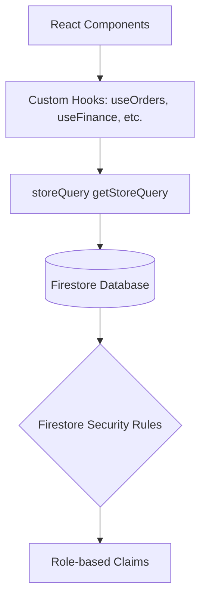

# COMPREHENSIVE PRODUCTION-READINESS AUDIT REPORT
**Jewellery Management ERP System**

---

## 1. Executive Summary

This report presents a comprehensive production-readiness audit of the Jewellery Management ERP codebase. The target system is a multi-store, role-based jewellery management platform powered by a React frontend and Firebase backend (Firestore database, Authentication, and Hosting).

While the system implements modern UI aesthetics and has a structured React design, multiple **critical structural, database, security, and performance risks** have been identified that would cause runtime crashes, data leakage, performance degradation, and billing failures in a live production environment.

### Production Readiness Score: **42 / 100** (NOT Production-Ready)

#### Key Findings at a Glance:
*   **Critical Runtime Crash in Billing:** The `InvoiceBilling.jsx` component passes invalid parameters to the store query constructor, which will crash the entire billing view on loading.
*   **Massive Missing Index Bottlenecks:** Almost all core modules (Finance, Logistics, Approvals, Invoices) execute store-specific queries with timestamp sorting. Because composite indexes for these fields do not exist in `firestore.indexes.json`, these queries will fail at runtime in Firestore.
*   **Performance Bottleneck in Customer Management (N/10 Query Loop):** The `useCustomers` hook fetches users in groups of 10 inside a loop based on orders, which will cause excessive Firestore reads (O(N) operations), hitting API rate limits and generating huge bills.
*   **Incomplete RBAC Enforcement:** Firebase Security Rules do not recognize essential production roles (Company Admin, Store Admin, Finance, Logistics), which will block authentic business operations or lead to privilege escalation.
*   **Unsynchronized Workflows:** Orders do not automatically reserve or decrement stock in the inventory module upon checkout.

---

## 2. Critical Issues

### CRITICAL-01: Runtime Crash in Invoice Billing Component
*   **File:** [InvoiceBilling.jsx](file:///src/admin/pages/InvoiceBilling.jsx#L31)
*   **Root Cause:** The component invokes `getStoreQuery('invoices', activeStoreId, [orderBy('createdAt', 'desc')])` without passing the required `db` (Firestore instance) as the first argument.
*   **Code Reference:**
    ```javascript
    const q = getStoreQuery('invoices', activeStoreId, [orderBy('createdAt', 'desc')]);
    ```
    However, the signature in [storeQuery.js](file:///src/utils/storeQuery.js#L23) is:
    ```javascript
    export function getStoreQuery(db, collectionName, activeStoreId, additionalConstraints = [])
    ```
*   **Risk:** The parameter mismatch shifts the arguments, causing `getStoreQuery` to treat `'invoices'` as `db` and the sorting array as `activeStoreId`. This will immediately throw a runtime exception and crash the billing screen.
*   **Recommended Fix:** Update the call in `InvoiceBilling.jsx` to pass `db` as the first argument:
    ```javascript
    const q = getStoreQuery(db, 'invoices', activeStoreId, [orderBy('createdAt', 'desc')]);
    ```

### CRITICAL-02: Widespread Runtime Failures due to Missing Firestore Composite Indexes
*   **Files:**
    *   [useFinance.js](file:///src/hooks/useFinance.js#L30-L32) (collections: `transactions`, `expenses`, `vendor_payments`)
    *   [useLogistics.js](file:///src/hooks/useLogistics.js#L53) (collection: `shipments`)
    *   [useApprovals.js](file:///src/hooks/useApprovals.js#L19) (collection: `approvals`)
    *   [InvoiceBilling.jsx](file:///src/admin/pages/InvoiceBilling.jsx#L31) (collection: `invoices`)
*   **Root Cause:** These hooks execute Firestore queries filtering by `storeId` (equality constraint) and sorting by `createdAt` or `timestamp` (range/ordering constraint). Firebase requires composite indexes for these fields. Currently, [firestore.indexes.json](file:///firestore.indexes.json) lacks these configurations.
*   **Risk:** Firestore will refuse to return data and reject the queries with index errors, causing these pages to display empty states or loading spinners indefinitely.
*   **Recommended Fix:** Add the following index definitions to `firestore.indexes.json`:
    ```json
    {
      "collectionGroup": "transactions",
      "queryScope": "COLLECTION",
      "fields": [
        { "fieldPath": "storeId", "order": "ASCENDING" },
        { "fieldPath": "createdAt", "order": "DESCENDING" }
      ]
    },
    {
      "collectionGroup": "expenses",
      "queryScope": "COLLECTION",
      "fields": [
        { "fieldPath": "storeId", "order": "ASCENDING" },
        { "fieldPath": "createdAt", "order": "DESCENDING" }
      ]
    },
    {
      "collectionGroup": "vendor_payments",
      "queryScope": "COLLECTION",
      "fields": [
        { "fieldPath": "storeId", "order": "ASCENDING" },
        { "fieldPath": "createdAt", "order": "DESCENDING" }
      ]
    },
    {
      "collectionGroup": "shipments",
      "queryScope": "COLLECTION",
      "fields": [
        { "fieldPath": "storeId", "order": "ASCENDING" },
        { "fieldPath": "createdAt", "order": "DESCENDING" }
      ]
    },
    {
      "collectionGroup": "approvals",
      "queryScope": "COLLECTION",
      "fields": [
        { "fieldPath": "storeId", "order": "ASCENDING" },
        { "fieldPath": "timestamp", "order": "DESCENDING" }
      ]
    },
    {
      "collectionGroup": "invoices",
      "queryScope": "COLLECTION",
      "fields": [
        { "fieldPath": "storeId", "order": "ASCENDING" },
        { "fieldPath": "createdAt", "order": "DESCENDING" }
      ]
    }
    ```

---

## 3. High Priority Issues

### HIGH-01: Severe N/10 Firestore Query Loop in Customer Hook
*   **File:** [useCustomers.js](file:///src/hooks/useCustomers.js#L91-L95) & [L121-L130]
*   **Root Cause:** When loading customer listings, the hook performs query requests inside a client-side loop to resolve staff members and customer order histories in groups of 10.
*   **Risk:** For a real-world store with 5,000 customers/orders, this translates to 500 separate Firestore network requests, leading to slow load times, high battery drain, and excessive read costs.
*   **Recommended Fix:** Implement a denormalized customer-to-store mapping collection or use a Cloud Function to run aggregate requests, rather than resolving entity references in loops on the client side.

### HIGH-02: Missing Stock Reservation / Decrement Workflow on Order Placement
*   **File:** [useOrders.js](file:///src/hooks/useOrders.js#L101-L139) (createOrder function)
*   **Root Cause:** When an order is placed, the order and shipping transactions are recorded, but there is no call to decrement stock in the inventory collection.
*   **Risk:** Overselling of luxury jewellery items can occur since stock counts remain unchanged until manual adjustments are made.
*   **Recommended Fix:** Wrap order creation and inventory decrement inside a Firestore Transaction in `createOrder` to ensure atomicity.

### HIGH-03: Security Rule Limitations on Key Enterprise Roles
*   **File:** [firestore.rules](file:///firestore.rules#L25)
*   **Root Cause:** Security rules define helpers like `isStaffOrHigher` using a hardcoded list of roles: `admin`, `superadmin`, `staff`, `manager`. Enterprise-specific roles like `company admin`, `finance`, and `logistics` are missing from these helper validations.
*   **Risk:** Users assigned to modern ERP roles (e.g. Finance or Logistics) will be blocked from accessing operations like writing transactions or managing shipments by Firestore security rules.
*   **Recommended Fix:** Update the helper functions in `firestore.rules` to include all enterprise roles defined by the system.

---

## 4. Medium Priority Issues

### MEDIUM-01: Customer Listings Lack Real-time Event Listeners
*   **File:** [useCustomers.js](file:///src/hooks/useCustomers.js#L58)
*   **Root Cause:** Unlike other hooks that use `onSnapshot` for real-time synchronization, `useCustomers` relies on a one-time `getDocs` fetch.
*   **Risk:** The admin team will not see new customer registrations or staff check-ins without manually refreshing the screen or switching stores.
*   **Recommended Fix:** Refactor the fetch utility inside `useCustomers` to register `onSnapshot` listeners.

### MEDIUM-02: Order Pagination Disabled on Store-Specific Views
*   **File:** [useOrders.js](file:///src/hooks/useOrders.js#L35-L41)
*   **Root Cause:** The hook disables limit constraints, ordering, and pagination cursor logic whenever `activeStoreId` is specified, to avoid index errors.
*   **Risk:** Performance will degrade as a store accumulates data, since every page load will fetch the store's entire order history.
*   **Recommended Fix:** Re-enable pagination for store-scoped queries because the composite index for `orders` (`storeId` + `createdAt` DESC) is already defined in `firestore.indexes.json`.

---

## 5. Low Priority Issues

### LOW-01: Public Read Access to Shipment Tracking History
*   **File:** [firestore.rules](file:///firestore.rules#L158)
*   **Root Cause:** The rules allow public reading of `tracking_history` to enable customer tracking without authentication.
*   **Risk:** Potential exposure of internal logistical comments or routes if database document IDs are guessed.
*   **Recommended Fix:** Restrict the read rule to require a valid `shipmentId` or customer authentication token where possible.

---

## 6. Architectural Improvements

1.  **Introduce a Service Layer:** Move direct Firestore interaction logic out of custom hooks and into dedicated service classes (e.g., `src/services/orderService.js`).
2.  **State Synchronization:** Establish a global store state or state reducer to share collections across components, reducing duplicate snapshot subscriptions.

---

## 7. Security Improvements
1.  **Robust Custom Claims Integration:** Ensure custom claims are set via Firebase Admin SDK in Cloud Functions for role authentication, rather than relying on fallback reads from the `/users` collection.
2.  **Enforced State Transitions:** Restrict update capabilities on shipments to the assigned logistics partner or admin, preventing unauthorized delivery status modifications.

---

## 8. Database Improvements
1.  **Address Inconsistent Fields:** Standardize timestamp tracking across collections. For example, standardise on `createdAt` and `updatedAt` for all collections, avoiding mixups with `date` or `timestamp`.
2.  **Denormalize Data:** Store basic customer details (name, phone) directly within the `orders` document to display them in lists without extra lookups.

---

## 9. Multi-Store Improvements
1.  **Bypass Auditing:** Ensure that when a Super Admin queries with `GLOBAL` view, their action is audited to track global data access.
2.  **Strict Store Matching:** Validate that items in a cart belong to the customer's selected store before checkout to prevent cross-store sales.

---

## 10. Performance Improvements
1.  **Query Limits:** Enforce query limits (e.g., `limit(50)`) across all search and listing views to prevent massive data loads.
2.  **Memoize Calculations:** Memoize expensive calculations (like tax estimations and order conversions) in list renderers to prevent UI lag.

---

## 11. Testing Improvements
1.  **Integration Testing:** Write integration tests for critical workflows (like order placement and inventory reduction).
2.  **Security Rule Tests:** Use the `@firebase/rules-unit-testing` package to verify that unauthorized roles cannot view transaction data.

---

## 12. Recommended Fix Order
1.  **Fix runtime crash** in `InvoiceBilling.jsx` (CRITICAL-01).
2.  **Deploy missing composite indexes** (CRITICAL-02).
3.  **Implement transaction-based stock updates** during checkout (HIGH-02).
4.  **Refactor N/10 Query loops** in customer hooks (HIGH-01).
5.  **Refactor security rules** for role validation (HIGH-03).
6.  **Re-enable pagination** in store-specific order queries (MEDIUM-02).

---

## 13. Detailed Action Plan

### Phase A: Fix Immediate Crashes & DB Queries (Est. Time: 1 Day)
*   Modify `InvoiceBilling.jsx` to pass `db` to `getStoreQuery`.
*   Deploy updated `firestore.indexes.json` with composite indexes.

### Phase B: Refactor Hooks & Optimize Performance (Est. Time: 2-3 Days)
*   Refactor `useCustomers.js` to eliminate client-side loops.
*   Update `useOrders.js` to re-enable store-specific pagination.

### Phase C: Secure Rules & Workflows (Est. Time: 2 Days)
*   Update `firestore.rules` with missing enterprise roles.
*   Implement transactional stock updates on checkout.
